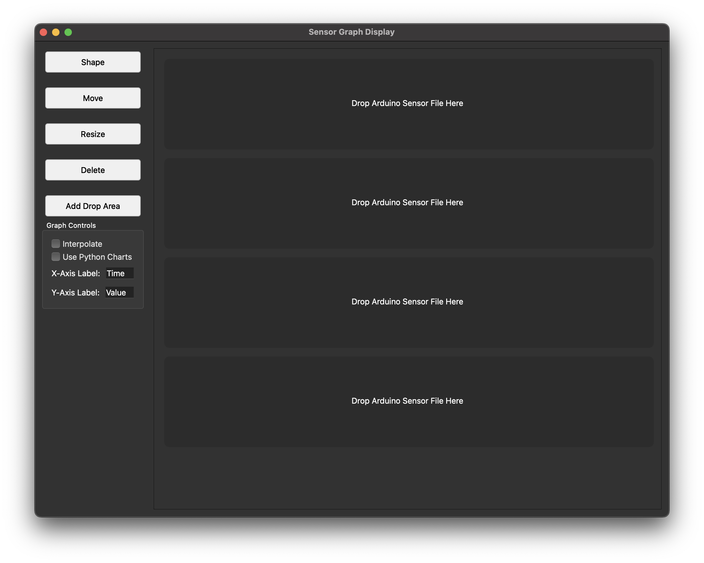

# Sensor Graph Display

A modern C++ and Python application for visualizing sensor data from CSV and TXT files with beautiful charts and interactive features.



## Features

- **Drag and Drop Interface**: Easily load data files by dragging and dropping them into the application
- **Multi-Series Visualization**: Display multiple data series on the same chart with customizable styles
- **High-Quality Charts**: Python-powered chart generation using Matplotlib for professional-looking visualizations
- **Multiple Chart Types**: Support for line, scatter, bar, area, step, and sine wave charts
- **Interactive Controls**: Customize colors, labels, chart settings, and toggle features in real-time
- **Detachable Charts**: Open charts in separate windows for better viewing or multi-monitor setups (right-click on a chart to open in a new window)
- **Real-time Interpolation**: Toggle smooth interpolation between data points
- **Multiple File Formats**: Import data from CSV, TXT, JSON and other text-based formats
- **Responsive UI**: Modern Qt-based user interface with intuitive controls

## System Requirements

- **Operating Systems**: macOS, Windows, or Linux
- **C++ Compiler**: A C++17 compatible compiler (GCC 7+, Clang 5+, MSVC 2017+)
- **Qt Framework**: Qt 6.x or newer
- **Python**: Python 3.6 or newer
- **Disk Space**: ~100MB for the application and dependencies
- **RAM**: 4GB minimum, 8GB recommended for larger datasets

## Quick Start Guide

The easiest way to get started is to use one of the provided launcher scripts:

### On macOS/Linux:

```bash
# Use the Python launcher (recommended)
./run_app.py

# Alternatively, use the bash script
./build_and_run.sh
```

### On Windows:

```bash
# Use the Python launcher (recommended)
python run_app.py
```

These scripts will:
1. Check for required dependencies
2. Set up a Python virtual environment automatically
3. Install necessary Python packages
4. Build the application using CMake
5. Launch the application

## Manual Installation

### Prerequisites

1. Install Qt 6.x or newer
2. Install CMake 3.16 or newer
3. Install Python 3.6+ and pip
4. Clone this repository or extract the source code

### Step-by-Step Installation

1. **Set up Python environment and install dependencies**:
   ```bash
   # Create and activate a virtual environment (recommended)
   python -m venv venv
   # On Windows
   venv\Scripts\activate
   # On macOS/Linux
   source venv/bin/activate
   
   # Install required Python packages
   cd python
   pip install -r requirements.txt
   cd ..
   ```

2. **Build the application using CMake**:
   ```bash
   mkdir build && cd build
   cmake ..
   # On Windows
   cmake --build . --config Release
   # On macOS/Linux
   make -j4
   ```

3. **Run the application**:
   ```bash
   # On Windows
   .\Release\SensorGraphDisplay.exe
   # On macOS/Linux
   ./SensorGraphDisplay
   ```

## Usage Guide

### Loading Data

1. Launch the Sensor Graph Display application
2. Drag and drop your CSV, TXT, or JSON data file into one of the drop areas
3. The application will automatically parse and display your data
4. Right-click on any chart to open it in a separate window for better viewing

### Sample Data

The application comes with sample data files to get you started:
- `sample_data.txt` - Simple single-column sensor readings
- `sample_data2.csv` - Multi-column CSV with different sensor types
- `test_chart_data.json` - Example chart configuration

### Customizing Charts

Use the control panel to customize your visualizations:

- **Chart Type**: Select from line, scatter, bar, area, or step chart types
- **Interpolation**: Toggle smooth interpolation between data points
- **Chart Engine**: Switch between native C++ and Python chart generation
- **Series Visibility**: Show/hide individual data series
- **Colors and Styles**: Customize the appearance of each data series
- **Axis Settings**: Configure axis labels, ranges, and grid options

### Toolbar Controls

The toolbar provides quick access to common functions:

- **Add Graph**: Create a new graph area to load additional data
- **Detach**: Open the current chart in a separate window
- **Export**: Save the chart as an image file
- **Reset View**: Return to the default view settings
- **Help**: Access application help and documentation

**Note**: The buttons on the left side (Shape, Move, Resize, Delete) only work with the native Qt chart approach. These interactive controls are not available when using the Python-based chart visualization.

## Data Format

The application supports the following data formats:

### CSV Files

For multi-column data with headers:
```
time,temperature,humidity,pressure,light,motion,co2
0,25.2,60.5,1013.2,512,0,410
1,25.3,60.7,1013.1,510,0,412
...
```

### TXT Files

For simple single-column data:
```
23.5
24.1
24.8
...
```

### JSON Files

For structured data in JSON format:
```json
{
  "title": "Test Chart",
  "x_label": "Time",
  "y_label": "Values",
  "chart_type": "line",
  "interpolate": true,
  "series": [
    {
      "name": "Temperature",
      "color": "#ff0000",
      "visible": true,
      "x_values": [
        0,
        1,
        2,
        3,
        4,
        5,
        6,
        7,
        8,
        9,
        10
      ],
      "y_values": [
        25.5,
        25.7,
        25.8,
        26.0,
        26.2,
        26.5,
        26.7,
        26.9,
        27.1,
        27.3,
        27.5
      ]
    },
    {
      "name": "Pressure",
      "color": "#0000ff",
      "visible": true,
      "x_values": [
        0,
        1,
        2,
        3,
        4,
        5,
        6,
        7,
        8,
        9,
        10
      ],
      "y_values": [
        1013.2,
        1013.1,
        1013.0,
        1012.9,
        1012.8,
        1012.7,
        1012.6,
        1012.5,
        1012.4,
        1012.3,
        1012.2
      ]
    }
  ]
}
```

## Troubleshooting

### Python Chart Issues
- **Charts Not Displaying**: Ensure Python is correctly installed and in your PATH
- **Missing Dependencies**: Run `pip install -r python/requirements.txt` to install required packages
- **Performance Issues**: Try enabling fast mode in the settings menu for larger datasets

### Data Loading Problems
- **Parse Errors**: Check that your CSV/TXT files match the expected format
- **Unicode Issues**: Save your data files with UTF-8 encoding
- **Large Files**: For very large datasets (>100MB), consider downsampling your data

### Build Problems
- **CMake Errors**: Ensure you have a compatible Qt version (6.x+) and CMake 3.16+
- **Compiler Issues**: Verify you have a C++17 compatible compiler
- **Library Not Found**: Check that Python and Qt are correctly installed and discoverable

## Contributing

Contributions are welcome! Please feel free to submit a Pull Request.

## License

See the [MIT License](LICENSE) file for full details.

## Acknowledgments

- **Qt** for the application framework
- **Python, Matplotlib, and NumPy** for chart generation
- **CMake** for the build system
