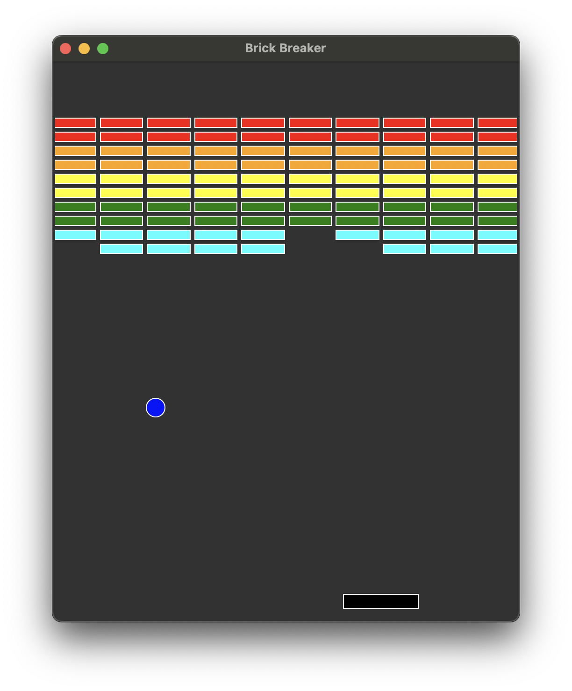

# Brick Breaker Game

Brick Breaker is a classic arcade game implemented using Python's tkinter library. The game involves breaking bricks using a bouncing ball controlled by a paddle.

## Game Features

- **Paddle Control**: Move the paddle horizontally to bounce the ball.
- **Brick Breaking**: Break bricks by bouncing the ball against them.
- **Winning Condition**: Break all the bricks to win the game.
- **Losing Condition**: Lose a life when the ball falls below the paddle three times.

## Gameplay

The game consists of a paddle that can be moved horizontally by the mouse. A ball bounces around the screen, and the player must use the paddle to bounce the ball against bricks at the top of the screen. Each brick hit removes the brick from play, and the goal is to remove all bricks to win. The game ends when all bricks are removed, or the player loses all lives.

## Controls

- **Mouse Movement**: Move the mouse horizontally to move the paddle.

## Screenshots



## Installation

1. **Clone the Repository**

   ```bash
   git clone https://github.com/AdrianCAG/Projects

2. **Run the Game**
    ```bash
    cd Python/Breakout/bin/
    source ./activate
    cd ..
    python3 main.py 

## Contributing
Contributions are welcome! Please fork the repository and submit a pull request for any enhancements or bug fixes.