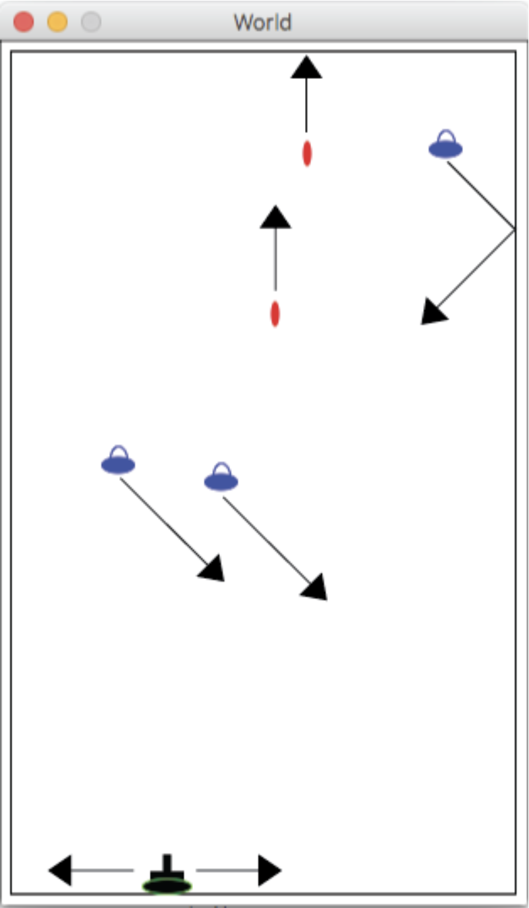

# Space Invaders

Welcome to Space Invaders! This project is a simple implementation of the classic Space Invaders game using the Racket programming language.

## Table of Contents
- [Introduction](#introduction)
- [Features](#features)
- [Screenshot](#screenshot)
- [Installation](#installation)
- [How to Play](#how-to-play)
- [License](#license)


## Introduction
Space Invaders is a classic arcade game where the player controls a spaceship at the bottom of the screen and shoots at aliens descending from the top. The goal is to destroy all the aliens.

## Features
- Control a spaceship to shoot at aliens
- Aliens move form side to side
- Aliens move towards bottom


## Screenshot


## Installation
To run the Space Invaders game, you need to have Racket installed on your machine. Follow these steps to install and run the game:

1. [Download and install Racket](https://racket-lang.org/download/)
2. Clone this repository:
   ```sh
   git clone https://github.com/AdrianCAG/Projects
3. Search for Racket folder
4. Run SpaceInvaders.rkt file with DrRacket
5. Pick Intermediate Student Language from bottom left (DrRacket IDE)


## How to Play
- Use the arrow keys to move your spaceship left and right.
- Press the spacebar to shoot at the aliens.
- Avoid being hit by alien.
- Destroy all the aliens.


## License
This project is licensed under the MIT License. See the [MIT License](LICENSE) file for details.

