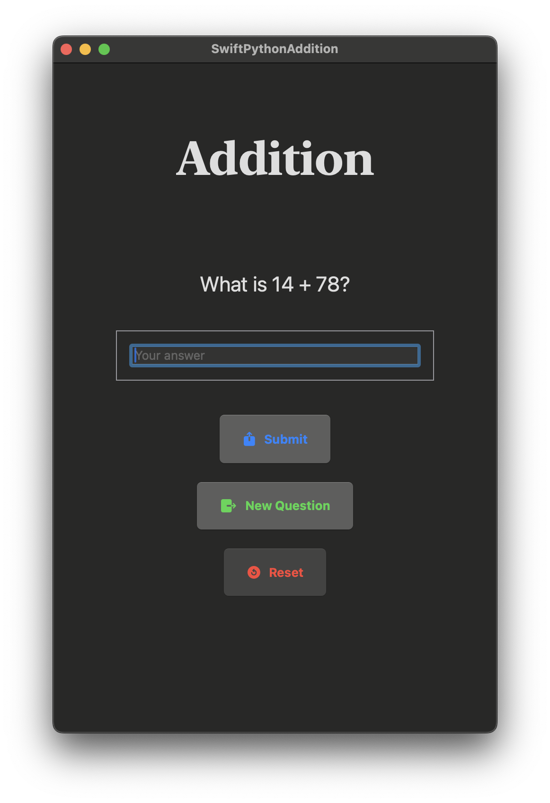

# Swift Python Addition

This project is a simple addition game that integrates Python with Swift. The game generates random addition questions, checks the user's answers, and provides feedback. After three consecutive correct answers, the game congratulates the user and offers an option to reset the game.

## Table of Contents
- [Features](#features)
- [Requirements](#requirements)
- [Setup](#setup)
- [Usage](#usage)
- [Code Overview](#code-overview)
- [License](#license)

## Features
- Generates random addition questions.
- Checks the user's answer for correctness.
- Tracks the number of consecutive correct answers.
- Provides feedback and congratulates the user after three correct answers in a row.
- Option to reset the game after three correct answers.

## Requirements
- Swift 5.10 or later
- Xcode 15.4 or later
- Python 3.12 or later
- PythonKit library

## Screenshots



## Setup
1. **Clone the Repository:**
   ```bash
   git clone https://github.com/AdrianCAG/Projects.git
   cd Swift\ and\ Python/Addition/SwiftPythonAddition/

## Usage
1. **Run the Project:**
    - Build and run the project in Xcode. The game UI should appear.

2. **Play the Game:**
    - Enter your answer for the addition question.
    - Press "Submit" to check your answer.
    - If correct, you will see a message indicating your streak of correct answers.
    - After three consecutive correct answers, the game congratulates you and the "Submit" and "New  Question" buttons are disabled.
    - Use the "Reset" button to reset the game and start over.


## Code Overview

### PythonScript.py
This script generates random addition questions and checks the user's answers.

### RunPythonScript.swift
This Swift file integrates the Python script with the Swift application using PythonKit.

### ContentView.swift
This SwiftUI view handles the UI and game logic.

