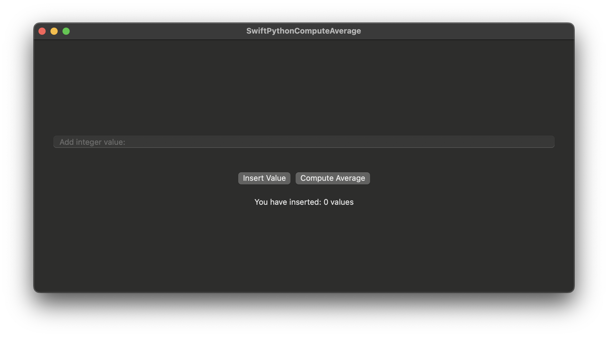

# SwiftPythonComputeAverage

This project demonstrates how to use Python code within a Swift application to perform computations. The project includes a simple Python script that calculates the average of a list of numbers, and a Swift application that interfaces with this script.

## Project Structure

- **PythonScript.py**: A Python script that manages a list of integers and computes their average.
- **RunPythonScript.swift**: A Swift script that sets up the Python environment and interfaces with the Python script.
- **ContentView.swift**: A SwiftUI view that provides a user interface for inserting numbers and computing the average.

## Requirements

- Swift 5.10 or later
- Xcode 15.4 or later
- Python 3.12 or later
- PythonKit library

## Screenshots


## Setup

1. **Clone the Repository**

   ```bash
   git clone <repository_url>
   cd Swift\ and\ Python/ComputeAverage/SwiftPythonComputeAverage/


## Usage
1. **Run the Application**
Build and run the Swift application using Xcode.

2. **Insert Values**
Use the text field to insert integer values. Click "Insert Value" to add the value to the list.

3. **Compute Average**
Click "Compute Average" to calculate and display the average of the inserted values.


## Example
1. Enter an integer value in the text field and click "Insert Value".
2. Repeat step 1 to add multiple values.
3. Click "Compute Average" to see the average of the inserted values.