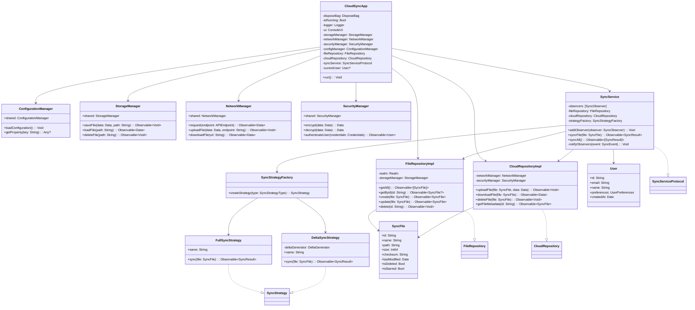
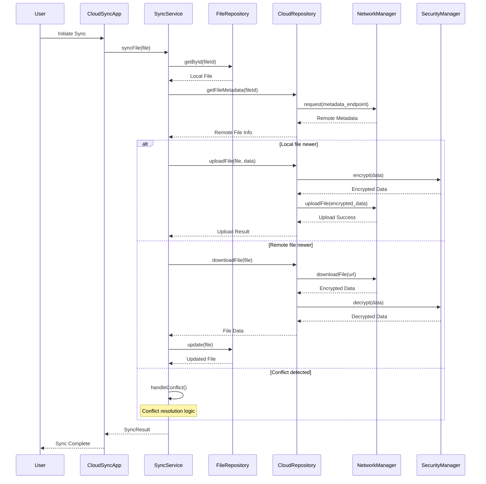
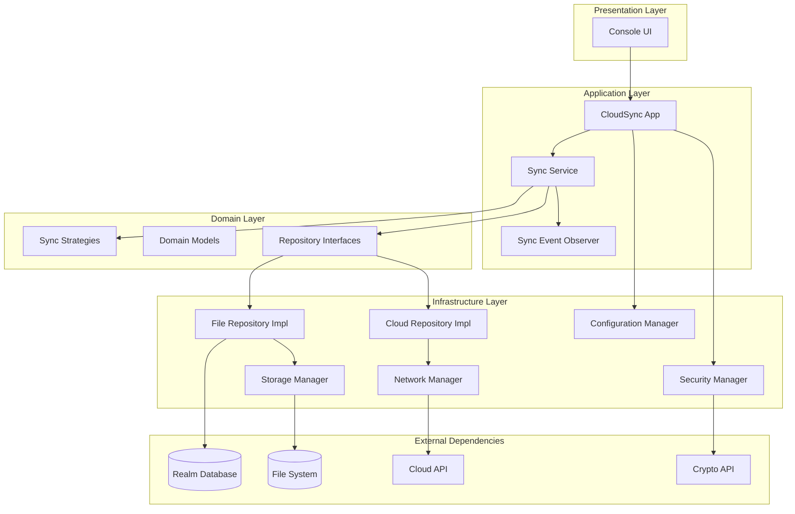

# CloudSyncPlatform Architecture Analysis

## Project Overview

### Description
A sophisticated cloud synchronization and storage system built in Swift that demonstrates advanced architectural patterns for secure file storage, synchronization, and sharing across multiple devices.

### Technology Stack
- **Language**: Swift 5.5+
- **Platform**: macOS 12+
- **Key Dependencies**: 
  - RxSwift (Reactive Programming)
  - Alamofire (Networking)
  - RealmSwift (Local Persistence)
  - Swift Crypto (Encryption)
  - Swift Log (Logging)
  - Rainbow (Console UI)
  - SwiftyJSON (JSON Handling)

### Architecture Pattern
**Clean Architecture** with clear separation of concerns across multiple layers:
- Presentation Layer (UI)
- Domain Layer (Business Logic)
- Data Layer (Repositories)
- Infrastructure Layer (Services)

## Project Structure

```
CloudSyncPlatform/
├── Sources/
│   ├── Configuration/          # Configuration management
│   ├── Extensions/            # Swift extensions
│   ├── Models/               # Domain models
│   ├── Network/              # Network layer
│   ├── Repositories/         # Data access layer
│   ├── Security/             # Security and encryption
│   ├── Services/             # Business logic services
│   ├── Storage/              # Local storage management
│   ├── UI/                   # User interface
│   ├── Utils/                # Utility functions
│   └── main.swift            # Application entry point
├── Ai Instructions/          # Project analysis tools and templates
└── Package.swift            # Swift package configuration
```

## UML Class Diagram



## UML Sequence Diagram - File Synchronization Flow



## Component Architecture Diagram



## Design Patterns Identified

### 1. **Repository Pattern** ✅
- **Location**: `Sources/Repositories/`
- **Implementation**: Generic `Repository<T>` protocol with specific implementations
- **Purpose**: Abstracts data access logic from business logic
- **Files**: `Repository.swift`, `FileRepositoryImpl.swift`, `CloudRepositoryImpl.swift`
- **Benefits**: 
  - Testability through dependency injection
  - Clear separation between data access and business logic
  - Easy to swap data sources

### 2. **Strategy Pattern** ✅
- **Location**: `Sources/Services/SyncStrategy.swift`
- **Implementation**: Multiple sync strategies (`FullSyncStrategy`, `DeltaSyncStrategy`, `ScheduledSyncStrategy`, `SelectiveSyncStrategy`)
- **Purpose**: Allows runtime selection of synchronization algorithms
- **Benefits**: 
  - Easy to add new sync strategies without modifying existing code
  - Runtime algorithm selection based on context
  - Clean separation of different sync approaches

### 3. **Factory Method Pattern** ✅
- **Location**: `Sources/Services/SyncStrategyFactory.swift`
- **Implementation**: `SyncStrategyFactory` creates appropriate strategy instances
- **Purpose**: Centralizes strategy creation logic
- **Benefits**: 
  - Supports Strategy pattern implementation
  - Encapsulates object creation logic
  - Easy to extend with new strategy types

### 4. **Observer Pattern** ✅
- **Location**: `Sources/Services/SyncEventObserver.swift`, `SyncService.swift`
- **Implementation**: `SyncObserver` protocol with event notifications
- **Purpose**: Real-time updates for sync events
- **Events**: Sync progress, completion, conflicts, batch operations
- **Benefits**: 
  - Loose coupling between sync service and UI updates
  - Multiple observers can listen to same events
  - Real-time feedback to users

### 5. **Singleton Pattern** ✅
- **Location**: Multiple managers (`ConfigurationManager`, `NetworkManager`, `StorageManager`, etc.)
- **Implementation**: Shared instances for global state management
- **Purpose**: Ensures single instance of critical system components
- **Benefits**: 
  - Global access to shared resources
  - Consistent state across application
  - Resource efficiency

### 6. **Dependency Injection** ✅
- **Location**: Throughout the application
- **Implementation**: Constructor injection in services and repositories
- **Purpose**: Loose coupling and improved testability
- **Example**: `SyncService` receives repositories as dependencies
- **Benefits**: 
  - Improved testability with mock objects
  - Loose coupling between components
  - Easy to modify dependencies

### 7. **MVVM Architecture** ✅
- **Location**: Separation between Models, Services, and UI
- **Implementation**: Clear separation of concerns
- **Structure**: 
  - Models: `Sources/Models/`
  - Services: `Sources/Services/`
  - UI: `Sources/UI/`

## Code Quality Analysis

### Strengths

#### 1. **Clean Architecture**
- Well-structured layers with clear boundaries
- Proper separation of concerns
- Each layer has distinct responsibilities

#### 2. **Protocol-Oriented Programming**
- Extensive use of protocols for abstraction
- Clear contracts between components
- Easy to mock for testing

#### 3. **Reactive Programming**
- Consistent use of RxSwift for async operations
- Non-blocking operations throughout
- Clear data flow with observables

#### 4. **Error Handling**
- Comprehensive error handling with custom error types
- Proper error propagation through layers
- User-friendly error messages

#### 5. **Security**
- Built-in encryption using Swift Crypto
- Secure authentication mechanisms
- Data protection at rest and in transit

#### 6. **Modular Design**
- Clear separation of concerns across modules
- High cohesion within modules
- Low coupling between modules

### Areas for Improvement

#### 1. **Dependency Management**
- **Issue**: Heavy reliance on Singleton pattern
- **Impact**: Makes testing more difficult, creates global state
- **Suggestion**: Consider using a proper DI container (e.g., Swinject)
- **Benefit**: Better testability and reduced global state

#### 2. **Testing Infrastructure**
- **Observation**: No visible test files in current structure
- **Risk**: Difficult to ensure code quality and catch regressions
- **Recommendation**: Add comprehensive unit and integration tests
- **Focus Areas**: 
  - Repository implementations
  - Sync strategies
  - Business logic in services
  - Error handling scenarios

#### 3. **Configuration Management**
- **Enhancement**: Environment-specific configurations
- **Current State**: Single configuration approach
- **Suggestion**: Add configuration validation and environment profiles
- **Benefit**: Better deployment flexibility and error prevention

#### 4. **Error Recovery**
- **Gap**: Limited retry mechanisms for network failures
- **Impact**: Poor resilience in unreliable network conditions
- **Suggestion**: Implement circuit breaker pattern and exponential backoff
- **Benefit**: Better user experience during network issues

#### 5. **Performance Optimization**
- **Opportunity**: Add caching layer for frequently accessed data
- **Current**: Direct data access every time
- **Enhancement**: Implement background queue management
- **Benefit**: Better user experience and resource utilization

## Potential Enhancements

### 1. **Command Pattern Implementation**
```swift
protocol Command {
    func execute() -> Observable<Void>
    func undo() -> Observable<Void>
}

class SyncFileCommand: Command {
    private let file: SyncFile
    private let syncService: SyncService
    
    init(file: SyncFile, syncService: SyncService) {
        self.file = file
        self.syncService = syncService
    }
    
    func execute() -> Observable<Void> {
        return syncService.syncFile(file).map { _ in () }
    }
    
    func undo() -> Observable<Void> {
        // Implement undo logic
        return Observable.just(())
    }
}
```

### 2. **Circuit Breaker Pattern**
```swift
class CircuitBreaker {
    private enum State {
        case closed, open, halfOpen
    }
    
    private var state: State = .closed
    private var failureCount = 0
    private let failureThreshold: Int
    private let recoveryTimeout: TimeInterval
    
    init(failureThreshold: Int = 5, recoveryTimeout: TimeInterval = 30) {
        self.failureThreshold = failureThreshold
        self.recoveryTimeout = recoveryTimeout
    }
    
    func execute<T>(_ operation: @escaping () -> Observable<T>) -> Observable<T> {
        switch state {
        case .open:
            return Observable.error(CircuitBreakerError.circuitOpen)
        case .closed, .halfOpen:
            return operation()
                .do(onNext: { _ in self.onSuccess() },
                    onError: { _ in self.onFailure() })
        }
    }
    
    private func onSuccess() {
        failureCount = 0
        state = .closed
    }
    
    private func onFailure() {
        failureCount += 1
        if failureCount >= failureThreshold {
            state = .open
            scheduleRecovery()
        }
    }
}
```

### 3. **Caching Layer**
```swift
protocol CacheManager {
    func get<T: Codable>(key: String, type: T.Type) -> Observable<T?>
    func set<T: Codable>(key: String, value: T, expiration: TimeInterval?) -> Observable<Void>
    func remove(key: String) -> Observable<Void>
    func clear() -> Observable<Void>
}

class InMemoryCacheManager: CacheManager {
    private var cache: [String: CacheEntry] = [:]
    private let queue = DispatchQueue(label: "cache.queue", attributes: .concurrent)
    
    func get<T: Codable>(key: String, type: T.Type) -> Observable<T?> {
        return Observable.create { observer in
            self.queue.async {
                if let entry = self.cache[key], !entry.isExpired {
                    observer.onNext(entry.value as? T)
                } else {
                    observer.onNext(nil)
                }
                observer.onCompleted()
            }
            return Disposables.create()
        }
    }
    
    func set<T: Codable>(key: String, value: T, expiration: TimeInterval?) -> Observable<Void> {
        return Observable.create { observer in
            self.queue.async(flags: .barrier) {
                let entry = CacheEntry(value: value, expiration: expiration)
                self.cache[key] = entry
                observer.onNext(())
                observer.onCompleted()
            }
            return Disposables.create()
        }
    }
}

private struct CacheEntry {
    let value: Any
    let createdAt: Date
    let expiration: TimeInterval?
    
    init(value: Any, expiration: TimeInterval?) {
        self.value = value
        self.createdAt = Date()
        self.expiration = expiration
    }
    
    var isExpired: Bool {
        guard let expiration = expiration else { return false }
        return Date().timeIntervalSince(createdAt) > expiration
    }
}
```

## Security Considerations

### Current Implementation Strengths
- ✅ **Data Encryption**: Uses Swift Crypto for robust encryption
- ✅ **Secure Authentication**: Proper user authentication mechanism
- ✅ **Secure Transmission**: Data encrypted in transit
- ✅ **Access Control**: User-based access control for files

### Security Recommendations

#### 1. **API Security**
- **Add Rate Limiting**: Prevent API abuse and DoS attacks
- **Implementation**: Token bucket or sliding window algorithm
- **Benefit**: Protects against malicious usage patterns

#### 2. **Authentication Enhancements**
- **Token Refresh**: Implement automatic token refresh mechanism
- **Session Management**: Secure session handling with proper timeouts
- **Multi-Factor Authentication**: Consider adding MFA for sensitive operations

#### 3. **Input Validation**
- **Data Validation**: Strict validation at API boundaries
- **Sanitization**: Proper input sanitization to prevent injection attacks
- **File Type Validation**: Validate file types and sizes

#### 4. **Audit Logging**
- **Security Events**: Log all security-related events
- **Access Patterns**: Monitor unusual access patterns
- **Compliance**: Support compliance requirements with detailed logs

## Performance Considerations

### Current Strengths
- ✅ **Delta Synchronization**: Bandwidth-efficient sync with delta compression
- ✅ **Reactive Programming**: Non-blocking operations prevent UI freezing
- ✅ **Background Sync**: Synchronization happens in background threads
- ✅ **Efficient Storage**: Uses Realm for optimized local storage

### Performance Optimization Opportunities

#### 1. **Network Layer**
- **Connection Pooling**: Reuse HTTP connections for better performance
- **Request Batching**: Combine multiple small requests into batches
- **Compression**: Add gzip compression for API responses

#### 2. **Sync Optimization**
- **Intelligent Scheduling**: Sync based on user patterns and network conditions
- **Priority Queue**: Prioritize frequently used files
- **Incremental Sync**: Only sync changed portions of large files

#### 3. **Caching Strategy**
- **Multi-Level Caching**: Memory and disk caching layers
- **Cache Invalidation**: Smart cache invalidation strategies
- **Prefetching**: Predictive prefetching of likely-needed files

#### 4. **Resource Management**
- **Memory Management**: Optimize memory usage for large file operations
- **Disk Space**: Intelligent cleanup of temporary and cached files
- **Battery Optimization**: Reduce background activity when on battery

## Scalability Considerations

### Current Architecture Scalability
- ✅ **Modular Design**: Easy to scale individual components
- ✅ **Reactive Patterns**: Handle concurrent operations efficiently
- ✅ **Repository Pattern**: Easy to scale data access layer

### Scalability Recommendations

#### 1. **Horizontal Scaling**
- **Service Decomposition**: Break into smaller, focused services
- **Load Distribution**: Distribute sync operations across multiple instances
- **Database Sharding**: Consider sharding strategies for large datasets

#### 2. **Caching Architecture**
- **Distributed Caching**: Use Redis or similar for distributed caching
- **CDN Integration**: Content delivery network for file distribution
- **Edge Computing**: Process sync operations closer to users

#### 3. **Queue Management**
- **Message Queues**: Use message queues for async operations
- **Priority Queues**: Handle high-priority sync operations first
- **Backpressure Handling**: Manage system overload gracefully

## Testing Strategy Recommendations

### Unit Testing
- **Repository Layer**: Mock external dependencies
- **Service Layer**: Test business logic in isolation
- **Strategy Pattern**: Test each sync strategy independently
- **Error Scenarios**: Comprehensive error handling tests

### Integration Testing
- **End-to-End Flows**: Test complete sync workflows
- **External Services**: Test integration with cloud APIs
- **Database Operations**: Test Realm operations
- **Network Scenarios**: Test various network conditions

### Performance Testing
- **Load Testing**: Test with large numbers of files
- **Stress Testing**: Test system limits and failure modes
- **Memory Testing**: Test memory usage patterns
- **Network Testing**: Test various network conditions

## Deployment Considerations

### Current Setup
- **Platform**: macOS 12+ executable
- **Dependencies**: Managed through Swift Package Manager
- **Configuration**: Single configuration approach

### Deployment Recommendations

#### 1. **Environment Management**
- **Multiple Environments**: Development, staging, production
- **Configuration Management**: Environment-specific configurations
- **Feature Flags**: Toggle features without code changes

#### 2. **Monitoring and Observability**
- **Application Metrics**: Performance and usage metrics
- **Error Tracking**: Centralized error tracking and alerting
- **Health Checks**: System health monitoring

#### 3. **Backup and Recovery**
- **Data Backup**: Regular backup of user data
- **Disaster Recovery**: Recovery procedures for system failures
- **Version Rollback**: Ability to rollback to previous versions

## Conclusion

The CloudSyncPlatform demonstrates excellent architectural practices with proper implementation of multiple design patterns. The codebase shows:

### Key Strengths
1. **Solid Foundation**: Well-structured clean architecture
2. **Design Patterns**: Proper implementation of industry-standard patterns  
3. **Modern Practices**: Use of reactive programming and protocol-oriented design
4. **Security Focus**: Built-in security and encryption
5. **Modular Design**: Clear separation of concerns

### Primary Areas for Enhancement
1. **Testing Infrastructure**: Comprehensive test suite needed
2. **Dependency Management**: Move away from heavy singleton usage
3. **Resilience Patterns**: Add circuit breakers and retry mechanisms
4. **Performance Optimization**: Caching and connection pooling
5. **Monitoring**: Add observability and metrics

### Overall Assessment
This project serves as an excellent example of how to structure a complex Swift application with proper separation of concerns, protocol-oriented programming, and reactive patterns. The architectural foundation is solid and ready for production deployment with the recommended enhancements.

The implementation demonstrates deep understanding of software architecture principles and provides a strong foundation for building scalable, maintainable cloud synchronization systems.

### Recommendation
The project is well-architected and follows best practices. Focus on adding the missing testing infrastructure and resilience patterns to make it production-ready. The current architecture provides an excellent foundation for future enhancements and scaling requirements.