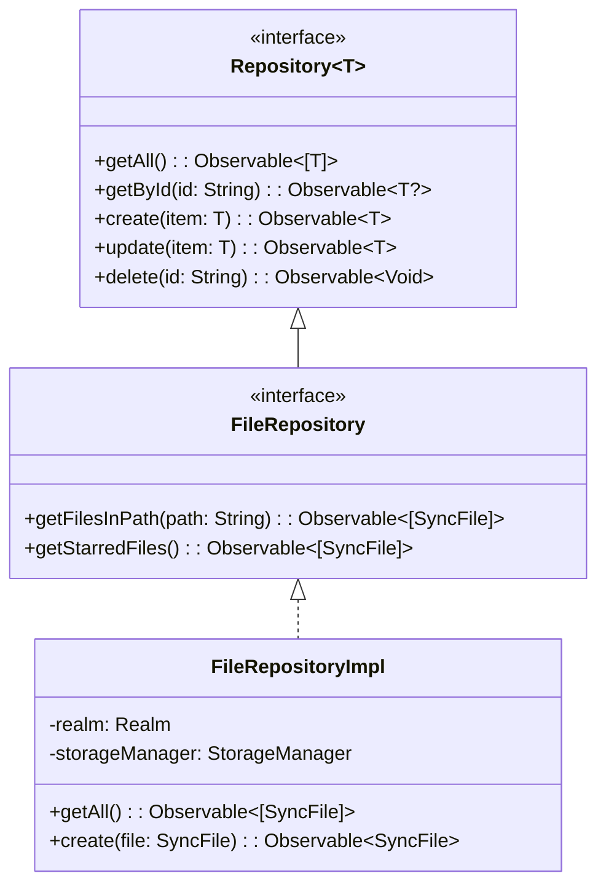

# Design Patterns in CloudSyncPlatform

This document provides a comprehensive overview of all design patterns implemented in the CloudSyncPlatform project, including their purpose, implementation details, benefits, and usage examples.

## Table of Contents

1. [Repository Pattern](#repository-pattern)
2. [Strategy Pattern](#strategy-pattern)
3. [Factory Method Pattern](#factory-method-pattern)
4. [Observer Pattern](#observer-pattern)
5. [Singleton Pattern](#singleton-pattern)
6. [Dependency Injection Pattern](#dependency-injection-pattern)
7. [MVVM Architecture Pattern](#mvvm-architecture-pattern)
8. [Additional Patterns](#additional-patterns)
9. [Pattern Interactions](#pattern-interactions)
10. [Best Practices](#best-practices)

---

## Repository Pattern

### Overview
The Repository Pattern abstracts data access logic and provides a uniform interface for accessing data from different sources (database, network, cache, etc.).

### Implementation Location
- **Files**: `Sources/Repositories/Repository.swift`, `Sources/Repositories/FileRepositoryImpl.swift`, `Sources/Repositories/CloudRepositoryImpl.swift`
- **Protocols**: `Repository<T>`, `FileRepository`, `CloudRepository`

### Pattern Structure

```swift
// Generic Repository Protocol
protocol Repository<T> {
    associatedtype T
    
    func getAll() -> Observable<[T]>
    func getById(_ id: String) -> Observable<T?>
    func create(_ item: T) -> Observable<T>
    func update(_ item: T) -> Observable<T>
    func delete(_ id: String) -> Observable<Void>
    func search(_ query: String) -> Observable<[T]>
}

// Specific Repository Protocol
protocol FileRepository: Repository where T == SyncFile {
    func getFilesInPath(_ path: String) -> Observable<[SyncFile]>
    func getStarredFiles() -> Observable<[SyncFile]>
    func getRecentlyModified(limit: Int) -> Observable<[SyncFile]>
}

// Concrete Implementation
class FileRepositoryImpl: FileRepository {
    private let realm: Realm
    private let storageManager: StorageManager
    
    init(realm: Realm, storageManager: StorageManager) {
        self.realm = realm
        self.storageManager = storageManager
    }
    
    func getAll() -> Observable<[SyncFile]> {
        return Observable.create { observer in
            let realmFiles = self.realm.objects(RealmSyncFile.self)
            let syncFiles = realmFiles.map { $0.toDomainModel() }
            observer.onNext(Array(syncFiles))
            observer.onCompleted()
            return Disposables.create()
        }
    }
    
    // Additional methods...
}
```

### Benefits
- **Separation of Concerns**: Business logic is separated from data access logic
- **Testability**: Easy to mock repositories for unit testing
- **Flexibility**: Can switch between different data sources without changing business logic
- **Consistency**: Uniform interface for all data operations
- **Maintainability**: Changes to data access logic are centralized

### Use Cases in Project
- **File Management**: Abstract local file storage operations
- **Cloud Operations**: Abstract cloud API interactions
- **User Management**: Abstract user data operations
- **Configuration**: Abstract configuration data access

### UML Diagram



---

## Strategy Pattern

### Overview
The Strategy Pattern defines a family of algorithms, encapsulates each one, and makes them interchangeable at runtime.

### Implementation Location
- **Files**: `Sources/Services/SyncStrategy.swift`, `Sources/Services/SyncStrategyFactory.swift`
- **Strategies**: `FullSyncStrategy`, `DeltaSyncStrategy`, `ScheduledSyncStrategy`, `SelectiveSyncStrategy`

### Pattern Structure

```swift
// Strategy Protocol
protocol SyncStrategy {
    var name: String { get }
    func sync(file: SyncFile) -> Observable<SyncResult>
    func canHandle(file: SyncFile) -> Bool
    func getPriority() -> Int
    func getEstimatedTime(file: SyncFile) -> TimeInterval
}

// Concrete Strategy: Full Sync
class FullSyncStrategy: SyncStrategy {
    let name = "Full Sync"
    private let fileRepository: FileRepository
    private let cloudRepository: CloudRepository
    
    init(fileRepository: FileRepository, cloudRepository: CloudRepository) {
        self.fileRepository = fileRepository
        self.cloudRepository = cloudRepository
    }
    
    func sync(file: SyncFile) -> Observable<SyncResult> {
        return Observable.create { observer in
            // Full synchronization logic
            self.performFullSync(file)
                .subscribe(
                    onNext: { result in observer.onNext(result) },
                    onError: { error in observer.onError(error) },
                    onCompleted: { observer.onCompleted() }
                )
        }
    }
    
    func canHandle(file: SyncFile) -> Bool {
        return true // Full sync can handle any file
    }
    
    private func performFullSync(_ file: SyncFile) -> Observable<SyncResult> {
        // Implementation details...
    }
}

// Concrete Strategy: Delta Sync
class DeltaSyncStrategy: SyncStrategy {
    let name = "Delta Sync"
    private let fileRepository: FileRepository
    private let cloudRepository: CloudRepository
    private let deltaGenerator: DeltaGenerator
    
    func sync(file: SyncFile) -> Observable<SyncResult> {
        return Observable.create { observer in
            // Delta synchronization logic
            self.performDeltaSync(file)
                .subscribe(
                    onNext: { result in observer.onNext(result) },
                    onError: { error in observer.onError(error) },
                    onCompleted: { observer.onCompleted() }
                )
        }
    }
    
    func canHandle(file: SyncFile) -> Bool {
        return file.size > 1024 * 1024 // Only for files > 1MB
    }
    
    private func performDeltaSync(_ file: SyncFile) -> Observable<SyncResult> {
        // Generate and apply deltas
    }
}

// Context Class
class SyncService {
    private let strategyFactory: SyncStrategyFactory
    
    func syncFile(_ file: SyncFile) -> Observable<SyncResult> {
        let strategy = strategyFactory.selectStrategy(for: file)
        return strategy.sync(file: file)
    }
}
```

### Benefits
- **Runtime Selection**: Choose algorithms dynamically based on context
- **Extensibility**: Easy to add new sync strategies without modifying existing code
- **Testability**: Each strategy can be tested independently
- **Performance Optimization**: Different strategies for different scenarios
- **Separation of Concerns**: Each algorithm is encapsulated in its own class

### Strategy Selection Logic

```swift
class SyncStrategyFactory {
    func selectStrategy(for file: SyncFile) -> SyncStrategy {
        let availableStrategies = getAllStrategies()
        
        // Filter strategies that can handle the file
        let compatibleStrategies = availableStrategies.filter { $0.canHandle(file) }
        
        // Select strategy with highest priority
        return compatibleStrategies.max { $0.getPriority() < $1.getPriority() } 
            ?? FullSyncStrategy() // Fallback
    }
}
```

### Use Cases
- **File Size Optimization**: Delta sync for large files, full sync for small files
- **Network Conditions**: Different strategies based on bandwidth
- **User Preferences**: Allow users to choose sync behavior
- **Performance Tuning**: Optimize based on system resources

---

## Factory Method Pattern

### Overview
The Factory Method Pattern creates objects without specifying their exact classes, delegating object creation to factory methods.

### Implementation Location
- **Files**: `Sources/Services/SyncStrategyFactory.swift`, `Sources/Services/SyncStrategy.swift`
- **Factory**: `SyncStrategyFactory`, `DefaultSyncStrategyFactory`

### Pattern Structure

```swift
// Factory Protocol
protocol SyncStrategyFactoryProtocol {
    func createStrategy(type: SyncStrategyType, config: SyncConfig) -> SyncStrategy
    func getAvailableStrategies() -> [SyncStrategyType]
    func getDefaultStrategy() -> SyncStrategy
}

// Concrete Factory
class DefaultSyncStrategyFactory: SyncStrategyFactoryProtocol {
    private let fileRepository: FileRepository
    private let cloudRepository: CloudRepository
    private let deltaGenerator: DeltaGenerator
    
    init(fileRepository: FileRepository, 
         cloudRepository: CloudRepository,
         deltaGenerator: DeltaGenerator) {
        self.fileRepository = fileRepository
        self.cloudRepository = cloudRepository
        self.deltaGenerator = deltaGenerator
    }
    
    func createStrategy(type: SyncStrategyType, config: SyncConfig) -> SyncStrategy {
        switch type {
        case .full:
            return createFullSyncStrategy(config: config)
        case .delta:
            return createDeltaSyncStrategy(config: config)
        case .scheduled:
            return createScheduledSyncStrategy(config: config)
        case .selective:
            return createSelectiveSyncStrategy(config: config)
        }
    }
    
    private func createFullSyncStrategy(config: SyncConfig) -> FullSyncStrategy {
        let strategy = FullSyncStrategy(
            fileRepository: fileRepository,
            cloudRepository: cloudRepository
        )
        strategy.configure(with: config)
        return strategy
    }
    
    private func createDeltaSyncStrategy(config: SyncConfig) -> DeltaSyncStrategy {
        let strategy = DeltaSyncStrategy(
            fileRepository: fileRepository,
            cloudRepository: cloudRepository,
            deltaGenerator: deltaGenerator
        )
        strategy.configure(with: config)
        return strategy
    }
    
    func getAvailableStrategies() -> [SyncStrategyType] {
        return [.full, .delta, .scheduled, .selective]
    }
    
    func getDefaultStrategy() -> SyncStrategy {
        return createStrategy(type: .full, config: SyncConfig.default)
    }
}

// Strategy Types Enumeration
enum SyncStrategyType: String, CaseIterable {
    case full = "full"
    case delta = "delta"
    case scheduled = "scheduled"
    case selective = "selective"
    
    var displayName: String {
        switch self {
        case .full: return "Full Synchronization"
        case .delta: return "Delta Synchronization"
        case .scheduled: return "Scheduled Synchronization"
        case .selective: return "Selective Synchronization"
        }
    }
}
```

### Benefits
- **Encapsulation**: Object creation logic is centralized
- **Flexibility**: Easy to modify object creation without changing client code
- **Consistency**: Ensures objects are created with proper configuration
- **Testability**: Easy to mock factories for testing
- **Extensibility**: New product types can be added without modifying existing code

### Advanced Factory Pattern

```swift
// Abstract Factory for creating related objects
protocol SyncComponentFactory {
    func createStrategy(type: SyncStrategyType) -> SyncStrategy
    func createObserver(type: ObserverType) -> SyncObserver
    func createRepository(type: RepositoryType) -> Any
}

class CloudSyncComponentFactory: SyncComponentFactory {
    func createStrategy(type: SyncStrategyType) -> SyncStrategy {
        // Create appropriate strategy
    }
    
    func createObserver(type: ObserverType) -> SyncObserver {
        // Create appropriate observer
    }
    
    func createRepository(type: RepositoryType) -> Any {
        // Create appropriate repository
    }
}
```

---

## Observer Pattern

### Overview
The Observer Pattern defines a one-to-many dependency between objects so that when one object changes state, all dependents are notified automatically.

### Implementation Location
- **Files**: `Sources/Services/SyncEventObserver.swift`, `Sources/Services/SyncService.swift`
- **Observers**: `SyncEventObserver`, `ConsoleUIObserver`, `LoggingObserver`, `NotificationObserver`

### Pattern Structure

```swift
// Observer Protocol (Subject Interface)
protocol SyncObserver: AnyObject {
    func onSyncEvent(_ event: SyncEvent)
    func getObserverId() -> String
    func isInterestedIn(event: SyncEvent) -> Bool
}

// Subject (Observable)
class SyncService: SyncServiceProtocol {
    private var observers: [SyncObserver] = []
    private let observerQueue = DispatchQueue(label: "sync.observers", attributes: .concurrent)
    
    // Observer Management
    func addObserver(_ observer: SyncObserver) {
        observerQueue.async(flags: .barrier) {
            if !self.observers.contains(where: { $0.getObserverId() == observer.getObserverId() }) {
                self.observers.append(observer)
            }
        }
    }
    
    func removeObserver(_ observer: SyncObserver) {
        observerQueue.async(flags: .barrier) {
            self.observers.removeAll { $0.getObserverId() == observer.getObserverId() }
        }
    }
    
    // Notification Method
    private func notifyObservers(_ event: SyncEvent) {
        observerQueue.async {
            let interestedObservers = self.observers.filter { $0.isInterestedIn(event: event) }
            
            DispatchQueue.main.async {
                interestedObservers.forEach { observer in
                    observer.onSyncEvent(event)
                }
            }
        }
    }
    
    // Business Logic Methods
    func syncFile(_ file: SyncFile) -> Observable<SyncResult> {
        notifyObservers(.syncStarted(file: file))
        
        return performSync(file)
            .do(
                onNext: { result in
                    self.notifyObservers(.syncCompleted(file: file, result: result))
                },
                onError: { error in
                    self.notifyObservers(.syncFailed(file: file, error: error))
                }
            )
    }
}

// Concrete Observer: UI Updates
class ConsoleUIObserver: SyncObserver {
    private let ui: ConsoleUI
    private var progressBars: [String: ProgressBar] = [:]
    
    init(ui: ConsoleUI) {
        self.ui = ui
    }
    
    func onSyncEvent(_ event: SyncEvent) {
        switch event {
        case .syncStarted(let file):
            let progressBar = ui.createProgressBar(for: file.name)
            progressBars[file.id] = progressBar
            
        case .syncProgress(let file, let progress):
            progressBars[file.id]?.update(progress: progress)
            
        case .syncCompleted(let file, let result):
            progressBars[file.id]?.complete()
            ui.showSyncCompletion(file: file, result: result)
            progressBars.removeValue(forKey: file.id)
            
        case .syncFailed(let file, let error):
            progressBars[file.id]?.fail()
            ui.showError(file: file, error: error)
            progressBars.removeValue(forKey: file.id)
            
        case .conflictDetected(let localFile, let remoteFile):
            ui.showConflictDialog(localFile: localFile, remoteFile: remoteFile)
            
        case .batchSyncStarted(let fileCount):
            ui.showBatchSyncStart(fileCount: fileCount)
            
        case .batchSyncCompleted(let results):
            ui.showBatchSyncResults(results: results)
            
        case .syncQueueUpdated(let pendingCount):
            ui.updateSyncQueueIndicator(pendingCount: pendingCount)
        }
    }
    
    func getObserverId() -> String {
        return "console-ui-observer"
    }
    
    func isInterestedIn(event: SyncEvent) -> Bool {
        // UI observer is interested in all events
        return true
    }
}

// Concrete Observer: Logging
class LoggingObserver: SyncObserver {
    private let logger: Logger
    private let logLevel: LogLevel
    
    init(logger: Logger, logLevel: LogLevel = .info) {
        self.logger = logger
        self.logLevel = logLevel
    }
    
    func onSyncEvent(_ event: SyncEvent) {
        let message = formatEventMessage(event)
        
        switch event {
        case .syncFailed(_, let error):
            logger.error("\(message): \(error.localizedDescription)")
        case .conflictDetected:
            logger.warning(message)
        default:
            logger.info(message)
        }
    }
    
    func getObserverId() -> String {
        return "logging-observer"
    }
    
    func isInterestedIn(event: SyncEvent) -> Bool {
        return shouldLog(eventType: event.eventType)
    }
    
    private func formatEventMessage(_ event: SyncEvent) -> String {
        switch event {
        case .syncStarted(let file):
            return "Sync started for file: \(file.name)"
        case .syncCompleted(let file, let result):
            return "Sync completed for file: \(file.name) in \(result.timeElapsed)s"
        case .syncFailed(let file, _):
            return "Sync failed for file: \(file.name)"
        case .conflictDetected(let localFile, let remoteFile):
            return "Conflict detected between local file: \(localFile.name) and remote file: \(remoteFile.name)"
        default:
            return "Sync event: \(event.eventType)"
        }
    }
}

// Event Types
enum SyncEvent {
    case syncStarted(file: SyncFile)
    case syncProgress(file: SyncFile, progress: Double)
    case syncCompleted(file: SyncFile, result: SyncResult)
    case syncFailed(file: SyncFile, error: Error)
    case conflictDetected(localFile: SyncFile, remoteFile: SyncFile)
    case batchSyncStarted(fileCount: Int)
    case batchSyncCompleted(results: [SyncResult])
    case syncQueueUpdated(pendingCount: Int)
    
    var eventType: SyncEventType {
        switch self {
        case .syncStarted: return .syncStarted
        case .syncProgress: return .syncProgress
        case .syncCompleted: return .syncCompleted
        case .syncFailed: return .syncFailed
        case .conflictDetected: return .conflictDetected
        case .batchSyncStarted: return .batchSyncStarted
        case .batchSyncCompleted: return .batchSyncCompleted
        case .syncQueueUpdated: return .syncQueueUpdated
        }
    }
}
```

### Benefits
- **Loose Coupling**: Subjects and observers are loosely coupled
- **Dynamic Relationships**: Observers can be added/removed at runtime
- **Broadcast Communication**: One subject can notify multiple observers
- **Open/Closed Principle**: New observers can be added without modifying the subject
- **Separation of Concerns**: Different aspects (UI, logging, notifications) are handled separately

### Advanced Observer Features

```swift
// Filtered Observer
class FilteredSyncObserver: SyncObserver {
    private let baseObserver: SyncObserver
    private let eventFilter: (SyncEvent) -> Bool
    
    init(baseObserver: SyncObserver, filter: @escaping (SyncEvent) -> Bool) {
        self.baseObserver = baseObserver
        self.eventFilter = filter
    }
    
    func isInterestedIn(event: SyncEvent) -> Bool {
        return eventFilter(event) && baseObserver.isInterestedIn(event: event)
    }
}

// Composite Observer
class CompositeObserver: SyncObserver {
    private let observers: [SyncObserver]
    
    init(observers: [SyncObserver]) {
        self.observers = observers
    }
    
    func onSyncEvent(_ event: SyncEvent) {
        observers.forEach { $0.onSyncEvent(event) }
    }
}
```

---

## Singleton Pattern

### Overview
The Singleton Pattern ensures a class has only one instance and provides global access to that instance.

### Implementation Location
- **Files**: Multiple manager classes throughout the project
- **Singletons**: `ConfigurationManager`, `NetworkManager`, `StorageManager`, `SecurityManager`, `ConsoleUI`

### Pattern Structure

```swift
// Thread-Safe Singleton with Lazy Initialization
class ConfigurationManager {
    // MARK: - Singleton
    static let shared = ConfigurationManager()
    
    // MARK: - Properties
    private var configuration: [String: Any] = [:]
    private let configurationQueue = DispatchQueue(label: "configuration.queue", attributes: .concurrent)
    private let configPath: String
    
    // Private initializer prevents external instantiation
    private init() {
        self.configPath = Self.getConfigurationPath()
        loadConfiguration()
    }
    
    // MARK: - Public Methods
    func getProperty<T>(key: String, defaultValue: T) -> T {
        return configurationQueue.sync {
            return configuration[key] as? T ?? defaultValue
        }
    }
    
    func setProperty<T>(key: String, value: T) {
        configurationQueue.async(flags: .barrier) {
            self.configuration[key] = value
            self.saveConfiguration()
        }
    }
    
    func loadConfiguration() {
        configurationQueue.async(flags: .barrier) {
            do {
                let data = try Data(contentsOf: URL(fileURLWithPath: self.configPath))
                self.configuration = try JSONSerialization.jsonObject(with: data) as? [String: Any] ?? [:]
            } catch {
                // Use default configuration
                self.configuration = self.defaultConfiguration()
            }
        }
    }
    
    private func saveConfiguration() {
        do {
            let data = try JSONSerialization.data(withJSONObject: configuration)
            try data.write(to: URL(fileURLWithPath: configPath))
        } catch {
            print("Failed to save configuration: \(error)")
        }
    }
    
    private static func getConfigurationPath() -> String {
        let homeDirectory = FileManager.default.homeDirectoryForCurrentUser
        return homeDirectory.appendingPathComponent(".cloudsync/config.json").path
    }
    
    private func defaultConfiguration() -> [String: Any] {
        return [
            "sync_interval": 300,
            "max_file_size": 100 * 1024 * 1024,
            "encryption_enabled": true,
            "log_level": "info"
        ]
    }
}

// Network Manager Singleton
class NetworkManager {
    static let shared = NetworkManager()
    
    private let session: URLSession
    private let baseURL: URL
    private var authToken: String?
    private let networkQueue = DispatchQueue(label: "network.queue", attributes: .concurrent)
    
    private init() {
        let config = URLSessionConfiguration.default
        config.timeoutIntervalForRequest = 30
        config.timeoutIntervalForResource = 300
        self.session = URLSession(configuration: config)
        self.baseURL = URL(string: ConfigurationManager.shared.getProperty(key: "api_base_url", defaultValue: "https://api.cloudsync.com"))!
    }
    
    func setAuthToken(_ token: String) {
        networkQueue.async(flags: .barrier) {
            self.authToken = token
        }
    }
    
    func request(_ endpoint: APIEndpoint) -> Observable<Data> {
        return Observable.create { observer in
            self.networkQueue.async {
                let request = self.createRequest(for: endpoint)
                
                let task = self.session.dataTask(with: request) { data, response, error in
                    if let error = error {
                        observer.onError(error)
                        return
                    }
                    
                    guard let data = data else {
                        observer.onError(NetworkError.noData)
                        return
                    }
                    
                    observer.onNext(data)
                    observer.onCompleted()
                }
                
                task.resume()
            }
            
            return Disposables.create()
        }
    }
}

// Storage Manager Singleton
class StorageManager {
    static let shared = StorageManager()
    
    private let fileManager: FileManager
    private let basePath: URL
    private let storageQueue = DispatchQueue(label: "storage.queue", attributes: .concurrent)
    
    private init() {
        self.fileManager = FileManager.default
        self.basePath = Self.createBasePath()
        setupStorageStructure()
    }
    
    func saveFile(data: Data, path: String) -> Observable<Void> {
        return Observable.create { observer in
            self.storageQueue.async {
                do {
                    let fileURL = self.basePath.appendingPathComponent(path)
                    try self.fileManager.createDirectory(at: fileURL.deletingLastPathComponent(), 
                                                        withIntermediateDirectories: true)
                    try data.write(to: fileURL)
                    observer.onNext(())
                    observer.onCompleted()
                } catch {
                    observer.onError(error)
                }
            }
            return Disposables.create()
        }
    }
    
    private static func createBasePath() -> URL {
        let homeDirectory = FileManager.default.homeDirectoryForCurrentUser
        return homeDirectory.appendingPathComponent(".cloudsync/storage")
    }
    
    private func setupStorageStructure() {
        do {
            try fileManager.createDirectory(at: basePath, withIntermediateDirectories: true)
        } catch {
            fatalError("Failed to create storage directory: \(error)")
        }
    }
}
```

### Benefits
- **Global Access**: Single point of access to shared resources
- **Resource Management**: Prevents multiple instances of expensive resources
- **Consistency**: Ensures consistent state across the application
- **Memory Efficiency**: Saves memory by using only one instance

### Considerations and Best Practices

```swift
// Protocol-based Singleton for better testability
protocol ConfigurationManagerProtocol {
    func getProperty<T>(key: String, defaultValue: T) -> T
    func setProperty<T>(key: String, value: T)
}

class ConfigurationManager: ConfigurationManagerProtocol {
    static let shared: ConfigurationManagerProtocol = ConfigurationManager()
    // Implementation...
}

// Dependency injection for testing
class SyncService {
    private let configManager: ConfigurationManagerProtocol
    
    init(configManager: ConfigurationManagerProtocol = ConfigurationManager.shared) {
        self.configManager = configManager
    }
}

// Mock for testing
class MockConfigurationManager: ConfigurationManagerProtocol {
    private var properties: [String: Any] = [:]
    
    func getProperty<T>(key: String, defaultValue: T) -> T {
        return properties[key] as? T ?? defaultValue
    }
    
    func setProperty<T>(key: String, value: T) {
        properties[key] = value
    }
}
```

---

## Dependency Injection Pattern

### Overview
The Dependency Injection Pattern provides dependencies to an object rather than having the object create them itself, promoting loose coupling and testability.

### Implementation Location
- **Throughout the project**: Constructor injection is used extensively
- **Main Setup**: `Sources/main.swift` (CloudSyncApp initialization)

### Pattern Structure

```swift
// Constructor Injection
class SyncService: SyncServiceProtocol {
    private let fileRepository: FileRepository
    private let cloudRepository: CloudRepository
    private let strategyFactory: SyncStrategyFactory
    private let logger: Logger
    
    init(fileRepository: FileRepository,
         cloudRepository: CloudRepository,
         strategyFactory: SyncStrategyFactory,
         logger: Logger) {
        self.fileRepository = fileRepository
        self.cloudRepository = cloudRepository
        self.strategyFactory = strategyFactory
        self.logger = logger
    }
    
    func syncFile(_ file: SyncFile) -> Observable<SyncResult> {
        logger.info("Starting sync for file: \(file.name)")
        
        let strategy = strategyFactory.selectStrategy(for: file)
        return strategy.sync(file: file)
            .do(onNext: { result in
                self.logger.info("Sync completed for file: \(file.name)")
            })
    }
}

// Factory with Dependency Injection
class DefaultSyncStrategyFactory: SyncStrategyFactory {
    private let fileRepository: FileRepository
    private let cloudRepository: CloudRepository
    private let deltaGenerator: DeltaGenerator
    private let logger: Logger
    
    init(fileRepository: FileRepository,
         cloudRepository: CloudRepository,
         deltaGenerator: DeltaGenerator,
         logger: Logger) {
        self.fileRepository = fileRepository
        self.cloudRepository = cloudRepository
        self.deltaGenerator = deltaGenerator
        self.logger = logger
    }
    
    func createStrategy(type: SyncStrategyType) -> SyncStrategy {
        switch type {
        case .delta:
            return DeltaSyncStrategy(
                fileRepository: fileRepository,
                cloudRepository: cloudRepository,
                deltaGenerator: deltaGenerator,
                logger: logger
            )
        // Other cases...
        }
    }
}

// Repository with Dependency Injection
class FileRepositoryImpl: FileRepository {
    private let realm: Realm
    private let storageManager: StorageManager
    private let logger: Logger
    
    init(realm: Realm, storageManager: StorageManager, logger: Logger) {
        self.realm = realm
        self.storageManager = storageManager
        self.logger = logger
    }
    
    func create(_ file: SyncFile) -> Observable<SyncFile> {
        return Observable.create { observer in
            do {
                try self.realm.write {
                    let realmFile = RealmSyncFile()
                    realmFile.mapFrom(file)
                    self.realm.add(realmFile)
                }
                self.logger.info("File created in repository: \(file.name)")
                observer.onNext(file)
                observer.onCompleted()
            } catch {
                self.logger.error("Failed to create file: \(error)")
                observer.onError(error)
            }
            return Disposables.create()
        }
    }
}

// Main Application Setup (Composition Root)
class CloudSyncApp {
    private let disposeBag = DisposeBag()
    
    // Dependencies
    private let logger: Logger
    private let configManager: ConfigurationManager
    private let storageManager: StorageManager
    private let networkManager: NetworkManager
    private let securityManager: SecurityManager
    
    // Repositories
    private let fileRepository: