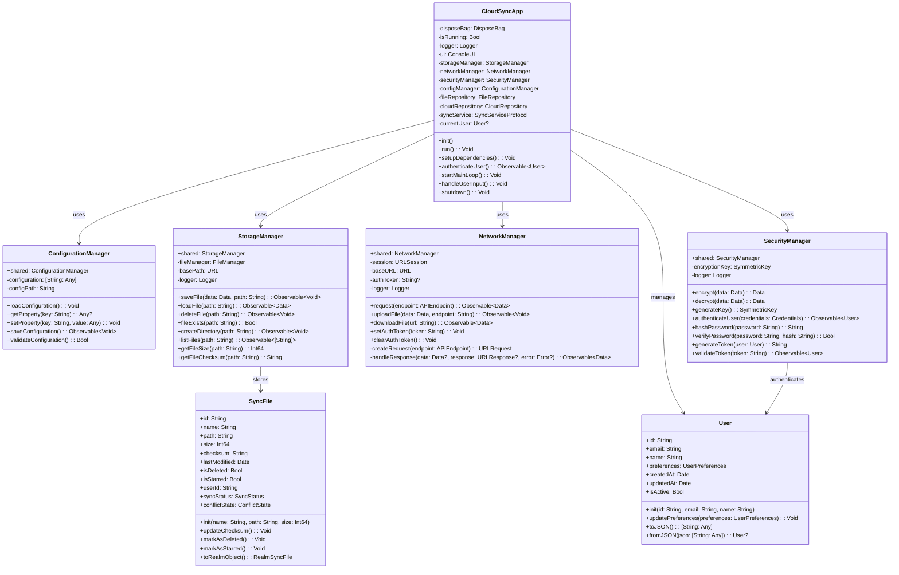
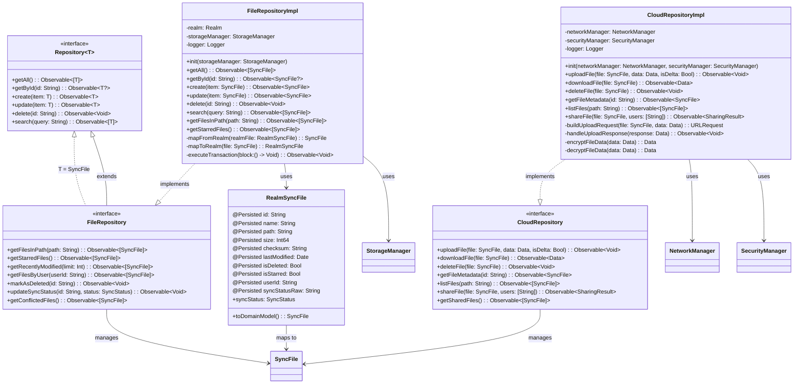
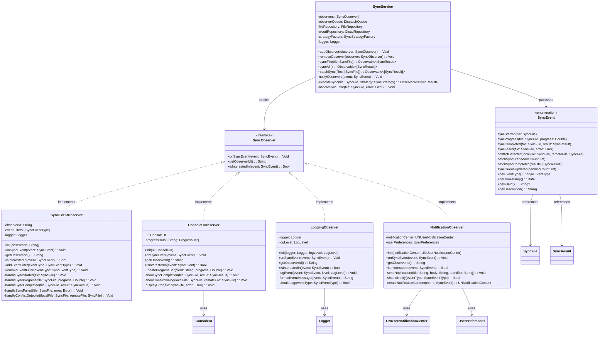
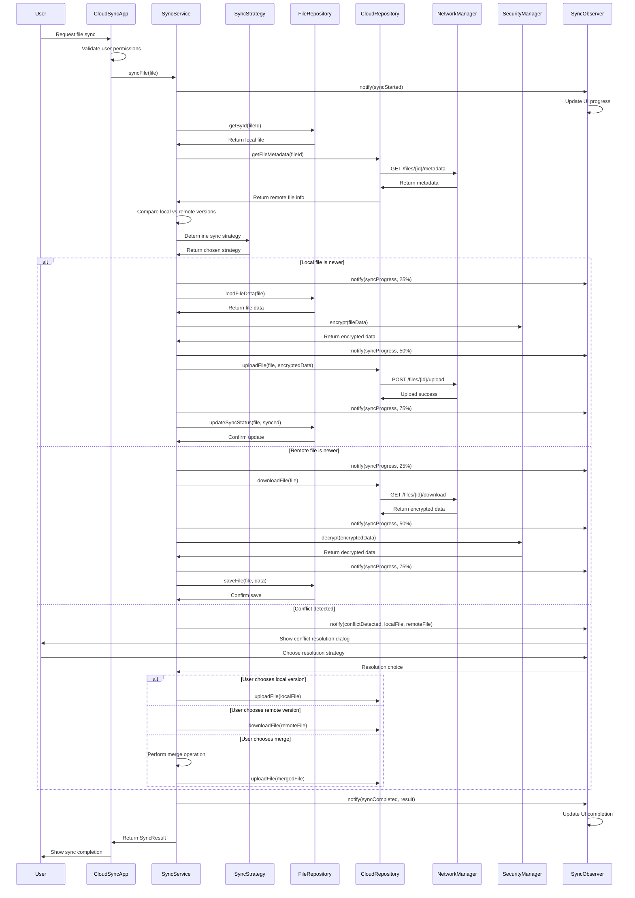
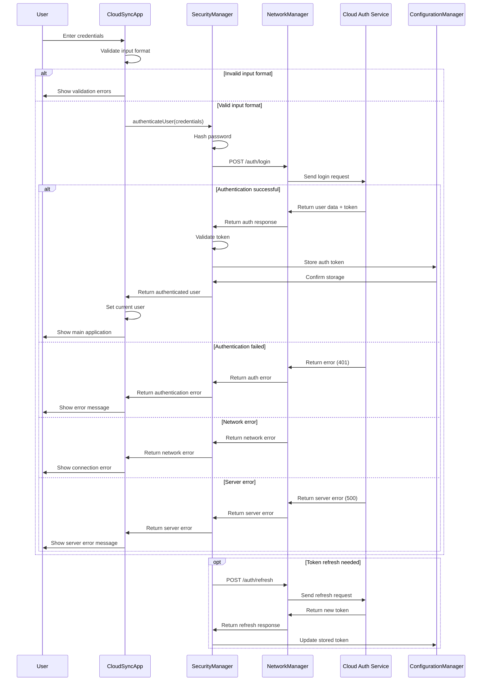

# CloudSyncPlatform UML Diagrams

This document contains comprehensive UML diagrams for the CloudSyncPlatform project, created using Mermaid syntax.

## Table of Contents

1. [Main Class Diagram](#main-class-diagram)
2. [Repository Pattern Diagram](#repository-pattern-diagram)
3. [Strategy Pattern Diagram](#strategy-pattern-diagram)
4. [Observer Pattern Diagram](#observer-pattern-diagram)
5. [File Synchronization Sequence Diagram](#file-synchronization-sequence-diagram)
6. [User Authentication Sequence Diagram](#user-authentication-sequence-diagram)
7. [Component Architecture Diagram](#component-architecture-diagram)
8. [Service Layer Diagram](#service-layer-diagram)
9. [State Diagram - File Sync States](#state-diagram---file-sync-states)
10. [Activity Diagram - Conflict Resolution](#activity-diagram---conflict-resolution)
11. [Database Schema Diagram](#database-schema-diagram)
12. [Deployment Architecture Diagram](#deployment-architecture-diagram)

---

## Main Class Diagram



---

## Repository Pattern Diagram



---

## Strategy Pattern Diagram

```mermaid
classDiagram
    class SyncStrategy {
        <<interface>>
        +name: String
        +sync(file: SyncFile): Observable~SyncResult~
        +canHandle(file: SyncFile): Bool
        +getPriority(): Int
        +getEstimatedTime(file: SyncFile): TimeInterval
    }

    class SyncStrategyFactory {
        <<interface>>
        +createStrategy(type: SyncStrategyType, config: SyncConfig): SyncStrategy
        +getAvailableStrategies(): [SyncStrategyType]
        +getDefaultStrategy(): SyncStrategy
    }

    class DefaultSyncStrategyFactory {
        -fileRepository: FileRepository
        -cloudRepository: CloudRepository
        -deltaGenerator: DeltaGenerator
        -logger: Logger
        +init(fileRepository: FileRepository, cloudRepository: CloudRepository)
        +createStrategy(type: SyncStrategyType, config: SyncConfig): SyncStrategy
        +getAvailableStrategies(): [SyncStrategyType]
        +getDefaultStrategy(): SyncStrategy
        -createFullSyncStrategy(): FullSyncStrategy
        -createDeltaSyncStrategy(): DeltaSyncStrategy
        -createScheduledSyncStrategy(): ScheduledSyncStrategy
        -createSelectiveSyncStrategy(): SelectiveSyncStrategy
    }

    class FullSyncStrategy {
        +name: String
        -fileRepository: FileRepository
        -cloudRepository: CloudRepository
        -logger: Logger
        +init(fileRepository: FileRepository, cloudRepository: CloudRepository)
        +sync(file: SyncFile): Observable~SyncResult~
        +canHandle(file: SyncFile): Bool
        +getPriority(): Int
        +getEstimatedTime(file: SyncFile): TimeInterval
        -performFullUpload(file: SyncFile): Observable~SyncResult~
        -performFullDownload(file: SyncFile): Observable~SyncResult~
        -checkForConflicts(localFile: SyncFile, remoteFile: SyncFile): ConflictState
    }

    class DeltaSyncStrategy {
        +name: String
        -fileRepository: FileRepository
        -cloudRepository: CloudRepository
        -deltaGenerator: DeltaGenerator
        -logger: Logger
        +init(fileRepository: FileRepository, cloudRepository: CloudRepository, deltaGenerator: DeltaGenerator)
        +sync(file: SyncFile): Observable~SyncResult~
        +canHandle(file: SyncFile): Bool
        +getPriority(): Int
        +getEstimatedTime(file: SyncFile): TimeInterval
        -generateDelta(oldFile: SyncFile, newFile: SyncFile): Observable~Data~
        -applyDelta(file: SyncFile, delta: Data): Observable~SyncFile~
        -uploadDelta(file: SyncFile, delta: Data): Observable~Void~
        -downloadDelta(file: SyncFile): Observable~Data~
    }

    class ScheduledSyncStrategy {
        +name: String
        -fileRepository: FileRepository
        -cloudRepository: CloudRepository
        -scheduler: Timer
        -syncQueue: [SyncFile]
        -logger: Logger
        +init(fileRepository: FileRepository, cloudRepository: CloudRepository)
        +sync(file: SyncFile): Observable~SyncResult~
        +canHandle(file: SyncFile): Bool
        +scheduleSync(file: SyncFile, delay: TimeInterval): Void
        +startScheduler(): Void
        +stopScheduler(): Void
        -processSyncQueue(): Void
        -shouldSyncNow(file: SyncFile): Bool
    }

    class SelectiveSyncStrategy {
        +name: String
        -fileRepository: FileRepository
        -cloudRepository: CloudRepository
        -syncRules: [SyncRule]
        -logger: Logger
        +init(fileRepository: FileRepository, cloudRepository: CloudRepository)
        +sync(file: SyncFile): Observable~SyncResult~
        +canHandle(file: SyncFile): Bool
        +addSyncRule(rule: SyncRule): Void
        +removeSyncRule(rule: SyncRule): Void
        -evaluateRules(file: SyncFile): Bool
        -applyFileFilters(file: SyncFile): Bool
    }

    class DeltaGenerator {
        -algorithm: DeltaAlgorithm
        -logger: Logger
        +init(algorithm: DeltaAlgorithm)
        +generateDelta(oldData: Data, newData: Data): Observable~Data~
        +applyDelta(originalData: Data, delta: Data): Observable~Data~
        +getDeltaSize(delta: Data): Int64
        +validateDelta(delta: Data): Bool
        -createBinaryDiff(old: Data, new: Data): Data
        -applyBinaryDiff(original: Data, diff: Data): Data
    }

    class SyncResult {
        +file: SyncFile
        +status: SyncStatus
        +error: Error?
        +bytesTransferred: Int64
        +timeElapsed: TimeInterval
        +strategyUsed: String
        +init(file: SyncFile, status: SyncStatus)
        +isSuccess: Bool
        +hasConflict: Bool
        +getErrorDescription(): String?
    }

    %% Strategy pattern relationships
    SyncStrategy <|.. FullSyncStrategy : implements
    SyncStrategy <|.. DeltaSyncStrategy : implements
    SyncStrategy <|.. ScheduledSyncStrategy : implements
    SyncStrategy <|.. SelectiveSyncStrategy : implements

    %% Factory pattern relationships
    SyncStrategyFactory <|.. DefaultSyncStrategyFactory : implements
    DefaultSyncStrategyFactory --> FullSyncStrategy : creates
    DefaultSyncStrategyFactory --> DeltaSyncStrategy : creates
    DefaultSyncStrategyFactory --> ScheduledSyncStrategy : creates
    DefaultSyncStrategyFactory --> SelectiveSyncStrategy : creates

    %% Dependencies
    DeltaSyncStrategy --> DeltaGenerator : uses
    DefaultSyncStrategyFactory --> DeltaGenerator : uses

    %% Result relationship
    SyncStrategy --> SyncResult : returns
    SyncResult --> SyncFile : contains
```



---

## Observer Pattern Diagram



---

## File Synchronization Sequence Diagram



---

## User Authentication Sequence Diagram



---

## Component Architecture Diagram

```mermaid
graph TB
    subgraph "Presentation Layer"
        ConsoleUI[Console UI Manager]
        ProgressBar[Progress Bar UI]
        ErrorDisplay[Error Display]
    end
    
    subgraph "Application Layer"
        CloudSyncApp[CloudSync Application]
        SyncCoordinator[Sync Coordinator]
        EventDispatcher[Event Dispatcher]
    end
    
    subgraph "Service Layer"
        SyncService[Sync Service]
        AuthService[Authentication Service]
        ConflictResolver[Conflict Resolution Service]
        NotificationService[Notification Service]
    end
    
    subgraph "Strategy Layer"
        SyncStrategyFactory[Sync Strategy Factory]
        FullSync[Full Sync Strategy]
        DeltaSync[Delta Sync Strategy]
        ScheduledSync[Scheduled Sync Strategy]
        SelectiveSync[Selective Sync Strategy]
    end
    
    subgraph "Repository Layer"
        FileRepo[File Repository]
        CloudRepo[Cloud Repository]
        UserRepo[User Repository]
        ConfigRepo[Configuration Repository]
    end
    
    subgraph "Infrastructure Layer"
        NetworkMgr[Network Manager]
        StorageMgr[Storage Manager]
        SecurityMgr[Security Manager]
        ConfigMgr[Configuration Manager]
        CacheMgr[Cache Manager]
        LoggingMgr[Logging Manager]
    end
    
    subgraph "Data Layer"
        Realm[(Realm Database)]
        FileSystem[(File System)]
        ConfigFiles[(Configuration Files)]
        LogFiles[(Log Files)]
    end
    
    subgraph "External Services"
        CloudAPI[Cloud Storage API]
        AuthAPI[Authentication API]
        NotificationAPI[Push Notification API]
        AnalyticsAPI[Analytics API]
    end

    %% Presentation to Application
    ConsoleUI --> CloudSyncApp
    ProgressBar --> SyncCoordinator
    ErrorDisplay --> EventDispatcher

    %% Application to Service
    CloudSyncApp --> SyncService
    CloudSyncApp --> AuthService
    SyncCoordinator --> ConflictResolver
    EventDispatcher --> NotificationService

    %% Service to Strategy
    SyncService --> SyncStrategyFactory
    SyncStrategyFactory --> FullSync
    SyncStrategyFactory --> DeltaSync
    SyncStrategyFactory --> ScheduledSync
    SyncStrategyFactory --> SelectiveSync

    %% Service to Repository
    SyncService --> FileRepo
    SyncService --> CloudRepo
    AuthService --> UserRepo
    CloudSyncApp --> ConfigRepo

    %% Repository to Infrastructure
    FileRepo --> StorageMgr
    CloudRepo --> NetworkMgr
    CloudRepo --> SecurityMgr
    UserRepo --> SecurityMgr
    ConfigRepo --> ConfigMgr
    FileRepo --> CacheMgr
    SyncService --> LoggingMgr

    %% Infrastructure to Data
    StorageMgr --> FileSystem
    NetworkMgr --> CloudAPI
    SecurityMgr --> AuthAPI
    ConfigMgr --> ConfigFiles
    LoggingMgr --> LogFiles
    FileRepo --> Realm

    %% Infrastructure to External
    NetworkMgr --> CloudAPI
    NetworkMgr --> AuthAPI
    NotificationService --> NotificationAPI
    LoggingMgr --> AnalyticsAPI

    %% Cross-cutting concerns
    SecurityMgr -.-> SyncService
    CacheMgr -.-> CloudRepo
    LoggingMgr -.-> SyncService
    EventDispatcher -.-> SyncService
```



---

## Service Layer Diagram

```mermaid
classDiagram
    class SyncService {
        -observers: [SyncObserver]
        -fileRepository: FileRepository
        -cloudRepository: CloudRepository
        -strategyFactory: SyncStrategyFactory
        -conflictResolver: ConflictResolver
        -syncQueue: SyncQueue
        -logger: Logger
        +addObserver(observer: SyncObserver): Void
        +removeObserver(observer: SyncObserver): Void
        +syncFile(file: SyncFile): Observable~SyncResult~
        +syncAll(): Observable~[SyncResult]~
        +batchSync(files: [SyncFile]): Observable~[SyncResult]~
        +pauseSync(): Void
        +resumeSync(): Void
        +cancelSync(fileId: String): Void
        +getSyncStatus(): SyncStatus
        +getSyncQueue(): [SyncFile]
        -selectStrategy(file: SyncFile): SyncStrategy
        -executeSync(file: SyncFile, strategy: SyncStrategy): Observable~SyncResult~
        -handleConflict(localFile: SyncFile, remoteFile: SyncFile): Observable~SyncResult~
        -notifyObservers(event: SyncEvent): Void
    }

    class ConflictResolver {
        -resolutionStrategies: [ConflictResolutionStrategy]
        -logger: Logger
        +resolveConflict(localFile: SyncFile, remoteFile: SyncFile): Observable~ConflictResolution~
        +addResolutionStrategy(strategy: ConflictResolutionStrategy): Void
        +removeResolutionStrategy(strategy: ConflictResolutionStrategy): Void
        -selectResolutionStrategy(conflict: Conflict): ConflictResolutionStrategy
        -applyResolution(resolution: ConflictResolution): Observable~SyncFile~
    }

    class AuthService {
        -securityManager: SecurityManager
        -networkManager: NetworkManager
        -tokenManager: TokenManager
        -logger: Logger
        +authenticateUser(credentials: Credentials): Observable~User~
        +refreshToken(): Observable~String~
        +logout(): Observable~Void~
        +validateSession(): Observable~Bool~
        +getCurrentUser(): User?
        -handleAuthError(error: AuthError): Observable~Never~
    }

    class NotificationService {
        -observers: [NotificationObserver]
        -userPreferences: UserPreferences
        -logger: Logger
        +sendNotification(notification: Notification): Observable~Void~
        +addObserver(observer: NotificationObserver): Void
        +removeObserver(observer: NotificationObserver): Void
        +updatePreferences(preferences: NotificationPreferences): Void
        -shouldSendNotification(type: NotificationType): Bool
        -formatNotification(event: SyncEvent): Notification
    }

    %% Service relationships
    SyncService --> ConflictResolver
    SyncService --> AuthService
    SyncService --> NotificationService
    ConflictResolver --> SyncService
    AuthService --> SecurityManager
    NotificationService --> UserPreferences
